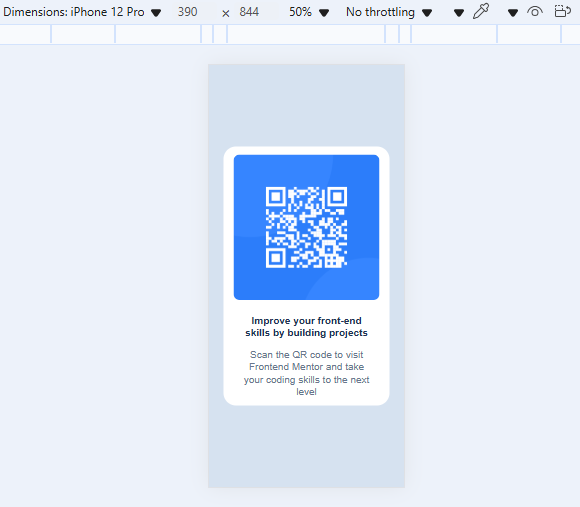

# Frontend Mentor - QR Code Component Solution

This is my solution to the [QR Code Component Challenge on Frontend Mentor](https://www.frontendmentor.io/challenges/qr-code-component-iux_sIO_H). It’s a simple and responsive card layout with a QR code, ideal for practicing HTML and CSS fundamentals.

## Table of Contents

- [Overview](#overview)
  - [Screenshot](#screenshot)
  - [Links](#links)
- [My Process](#my-process)
  - [Built With](#built-with)
  - [What I Learned](#what-i-learned)
- [Author](#author)

## Overview
This is a frontend challenge to build a simple, centered QR code card using HTML and CSS. The goal was to replicate a design as closely as possible, paying attention to layout, typography, and responsiveness. It helped me practice using rem units, Flexbox for centering, and Google Fonts.

### Screenshots


*Desktop view of the QR Code component*


*Mobile view of the QR Code component*

### Links

- Solution URL: [GitHub Repo](https://github.com/Mawuawoe/Frontend_projects/tree/main/qr-code-component-main)
- Live Site URL: [Live Demo](https://yourusername.github.io/qr-code-component)

## My Process

### Built With

- Semantic HTML5
- CSS3 (Flexbox + Custom Properties)
- Responsive Design using `rem` units
- Desktop-first approach
- Google Fonts (Outfit)

### What I Learned

While building this project, I solidified my understanding of:

- The benefits of using `rem` over `px` for scalable designs
- Applying a consistent layout with Flexbox
- Using media queries to adjust root font size and ensure responsive behavior
- Importing and using custom fonts with different weights via Google Fonts

Example of rem-based sizing:

```css
html {
  font-size: 16px;
}

.card {
  width: 20rem; /* equals 320px */
}

## Author
- GitHub – [@Mawuawoe](https://github.com/Mawuawoe)