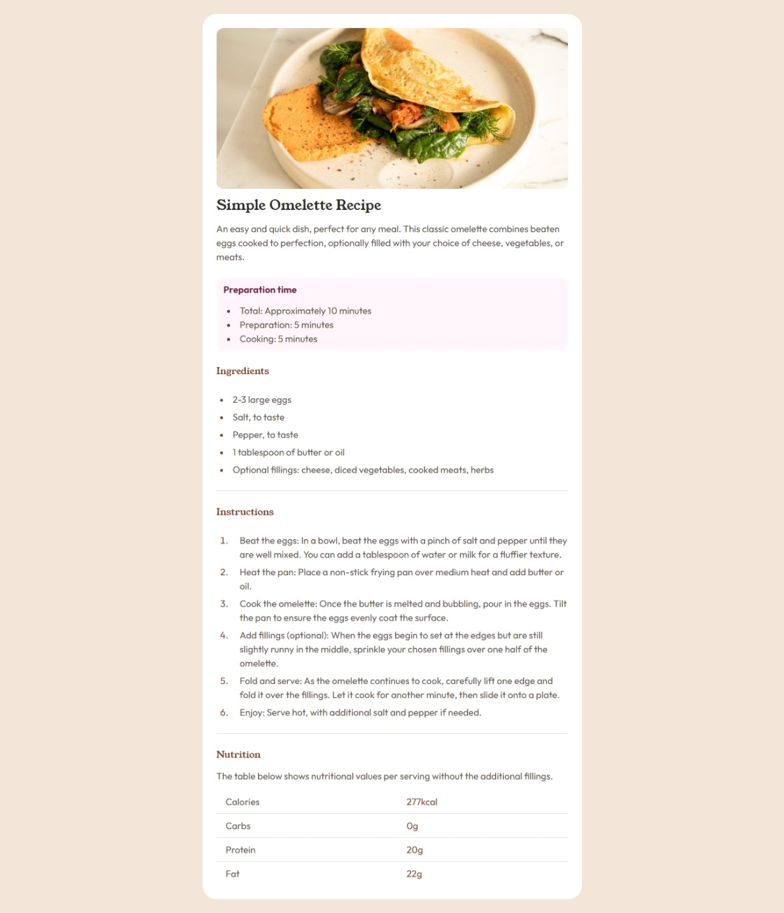

# Frontend Mentor - Recipe page solution

This is my solution to the [Recipe page challenge on Frontend Mentor](https://recipepage-weld.vercel.app/). The goal of this challenge is to build a clean, responsive recipe page using semantic HTML and modern CSS techniques. I used Tailwind CSS for styling.

## Table of contents

- [Overview](#overview)
  - [Screenshot](#screenshot)
  - [Links](#links)
- [My process](#my-process)
  - [Built with](#built-with)
  - [What I learned](#what-i-learned)
  - [Continued development](#continued-development)
  - [Useful resources](#useful-resources)
- [Author](#author)

## Overview

### Screenshot

### Links

- Solution URL: [recipe_page](https://github.com/Mawuawoe/Frontend_projects/tree/main/recipe-page-main/tailwind/src)
- Live Site URL: [recipe_page](https://recipepage-weld.vercel.app/)

## My process

### Built with

- Semantic HTML5
- Tailwind CSS utility classes
- Mobile-first workflow
- Flexbox & Grid layout utilities
- Tailwind Custom Colors & Typography utilities

### What I learned

This project helped me solidify my understanding of:
- Structuring semantic HTML sections like <header>, <section>, <article>, and <ol>.
- Using Tailwind utility classes efficiently to create spacing, typography, and layout.
- Applying custom colors and fonts in Tailwind V4.
- Making a clean, responsive layout with Tailwind CSS

### Continued development

Going forward, I want to:

- Improve my Tailwind workflow and naming consistency.

- Start working with component-based frameworks like React.

- Build more layout-heavy challenges to strengthen my understanding of responsive design.

- Explore Tailwind plugins (typography, forms, etc.).

### Useful resources

- [Tailwind CSS Docs](https://tailwindcss.com/docs/installation/using-vite) - Always helpful for quickly checking utilities.
- [MDN Web Docs](https://developer.mozilla.org/en-US/) - Great for confirming HTML semantics.

## Author

- GitHub - [Desmond Mawuawoe Dzakago](https://github.com/Mawuawoe/)

